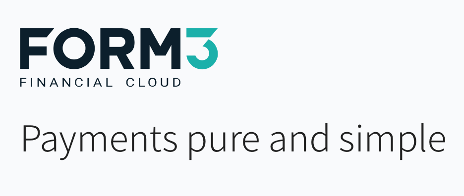

# Form3 API Client Library
<p>This is a client library used to access the Form3 Account API. It provides a common interface for fetching, 
creating and deleting account records.</p>


[](./images/form3.png)

## How to run this client library
---

<p>The recommended way of running this client library locally is through Docker.

This can be done with the following steps:

- Download Docker [here](https://www.docker.com/), select your OS and install it to your local machine.
- Verify Docker is running via this command: `docker -v` (You should see your Docker version).
- Type the command `docker-compose up ` which will load all the service integrations and run the unit tests (This may take a minute because of the API health check).
</p>

<p>You can also run this application locally using the Golang CLI but you will still need Docker to run the services declared in `docker-compose.
This can be done with these steps:

- Download Docker as described above.
- Go to the Golang official site [here](https://go.dev/) to download the SDK/CLI.
- Verify Go has been installed successfully with this command: `go -v` to check the Golang version.
- Create a new `.env` file in the root of the project and add this line to it: `BASE_URL=http://localhost:8080/v1`
- To run all unit tests type `go test -v ./...`
</p>

## How to make account requests
---
<p>
To create a new account using the Form3 Client Library, it's recommended that you use this function:

`func NewCreateAccount(version int64, accType string, accAttributes *AccountAttributes) *Account`

The `AccountAttributes` is a struct for the account bank details. See example below:

```
AccountAttributes{
		AccountClassification:   &accClassification,
		AccountNumber:           "10000004",
		BankID:                  "400302",
		BankIDCode:              "GBDSC",
		BaseCurrency:            "GBP",
		Bic:                     "NWBKGB42",
		Country:                 &country,
		Iban:                    "GB28NWBK40030212764204",
		JointAccount:            new(bool),
		Name:                    []string{"Nick", "Gowdy"},
		SecondaryIdentification: id,
	}
```

Finally the `Account` struct is used to make the account create request:
```
account := NewCreateAccount(0, "accounts", &accAttributes)
	createdAccResp, err := DoCreate(account)
```

If the account is saved successfully, an `AccountResponse` struct will be returned with the account record.

To Fetch or Delete a record, all that is need are the following:

- Account Id
- Account Version

You can make a request to fetch a record using this:

```
account = NewFetchAccount(ID, Version)
	accResp, err := DoFetch(account)
```

And similarly with a delete request:

```
account = NewDeleteAccount(ID, Version)
isDeleted, err := DoDelete(account)
```

Fetch will return an `AccountResponse` and Delete will return a truthy of `true` is account was deleted successfully.
</p>

## Further improvements

<p>
Currently the logic is written to handle GB accounts. If I were to work on this further I would refactor
the models so there are structs for different country accounts as each country has different business rules.

This is why I made `type Form3 interface` generic, each country struct can reuse the same interface. I prefer 
this approach as it reminds me of the Open/Closed principle in SOLID, and it also makes the code more polymorphic.

I would then write unit tests for each country for `Fetch` `Create` and `Delete` to make sure it works for each country
correctly.
</p>